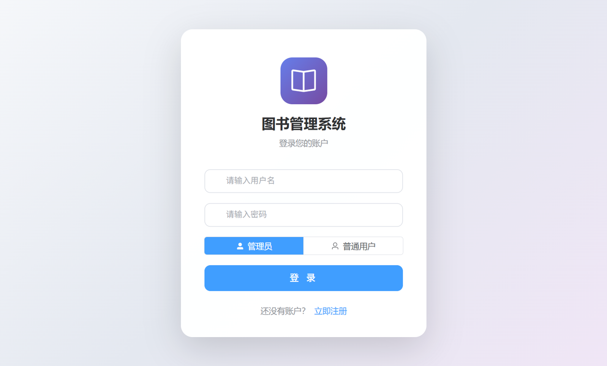
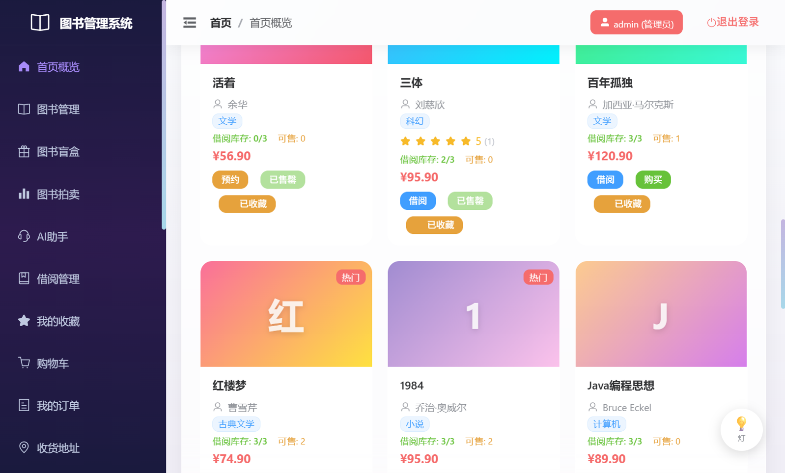
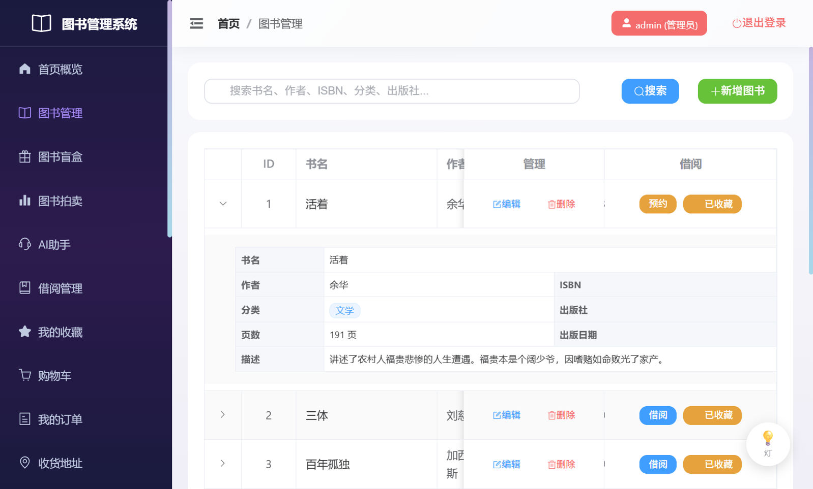
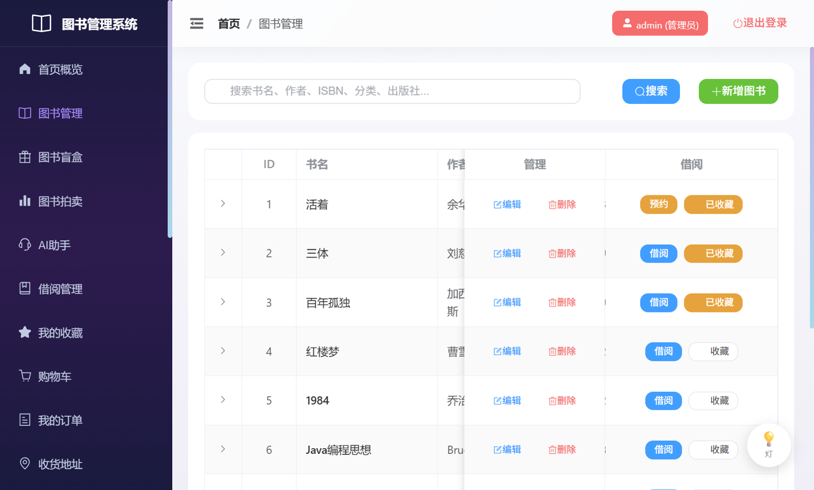
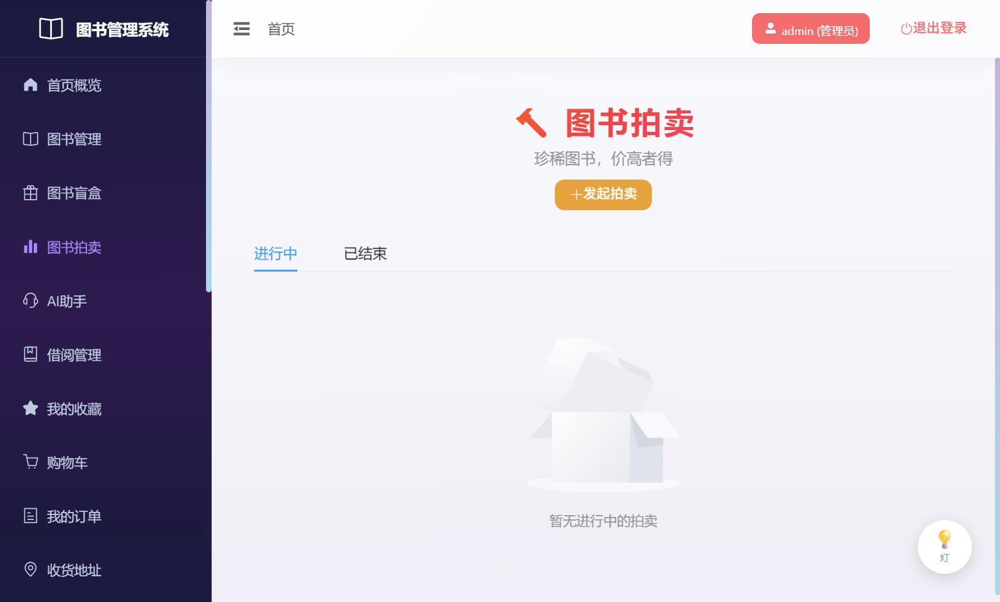
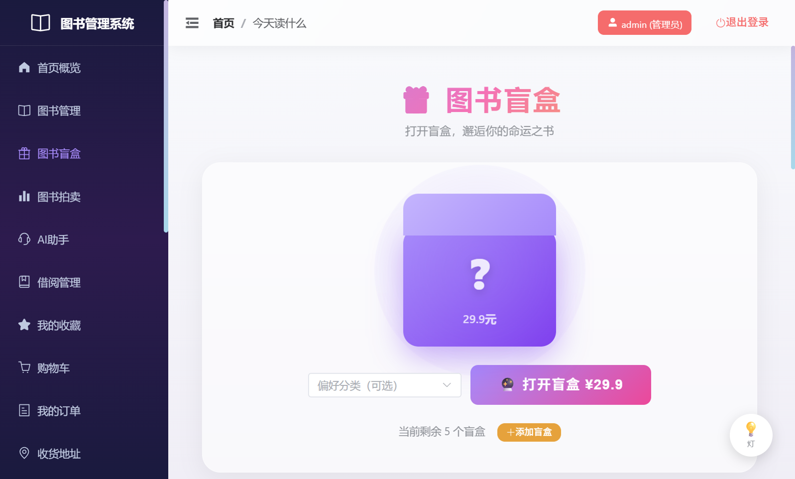
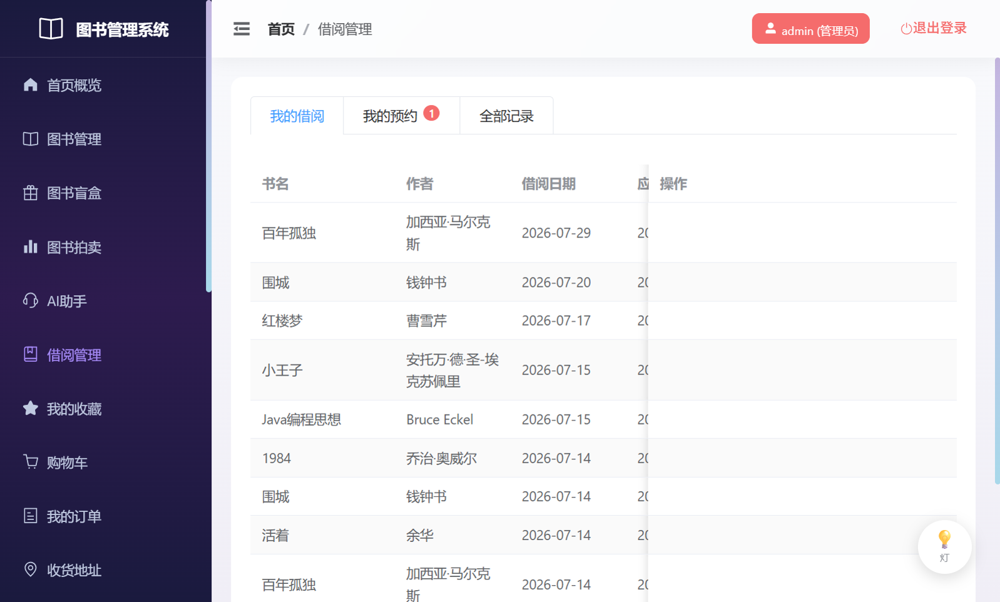
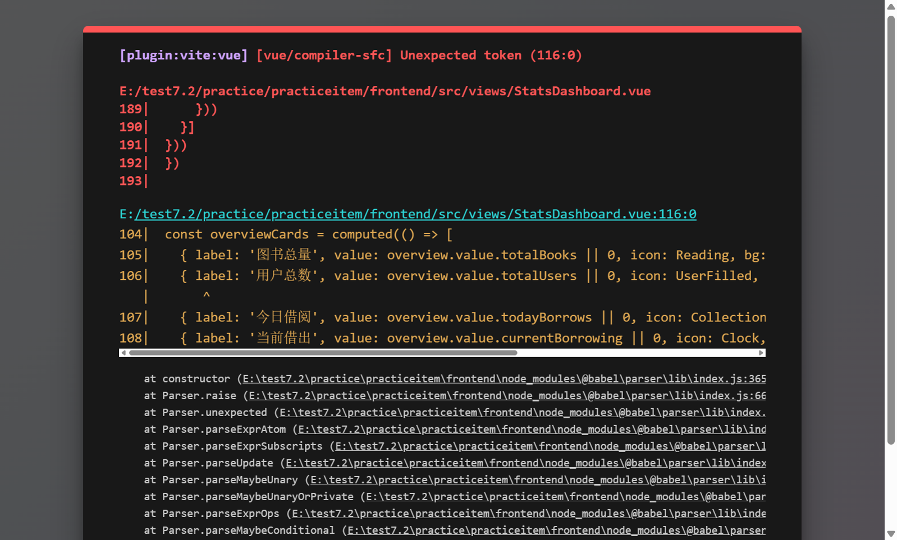
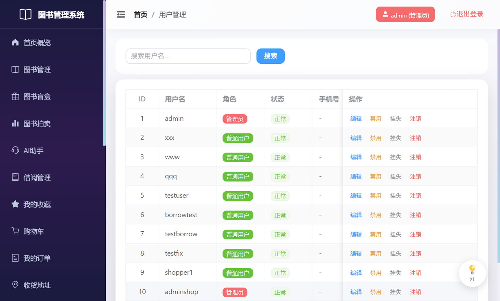

# 图书管理系统 (Book Manager)

一个基于 Spring Boot + Vue 3 的全栈图书管理系统，集成图书管理、借阅、电商、拍卖、盲盒、社交、共读挑战、成就徽章等丰富功能，打造一站式阅读生态平台。

## 项目介绍

本项目是一个功能完备的图书管理系统，面向普通用户与管理员两类角色。系统不仅提供传统的图书增删改查与借阅管理，还创新性地融入了电商购物、拍卖竞价、盲盒抽奖、社交互动、共读挑战、AI 助手等模块，构建了完整的阅读社交生态。

系统采用前后端分离架构，后端基于 Spring Boot 3 提供 RESTful API，前端使用 Vue 3 + Element Plus 构建现代化交互界面，通过 JWT 实现无状态身份认证。

## 功能列表

### 核心图书业务
- **图书管理**：图书信息维护（增删改查）、分类筛选、关键词搜索、库存管理
- **借阅管理**：图书借阅、归还、续借，借阅记录查询，超期提醒
- **预约管理**：热门图书预约，到书通知
- **阅读笔记**：图书阅读笔记、书评、书摘漂流瓶、好书引言

### 电商交易模块
- **购物车**：商品加入、数量调整、批量结算
- **订单系统**：订单创建、支付、发货、确认收货、取消退款
- **收货地址**：多地址管理、默认地址设置
- **图书拍卖**：起拍价、加价幅度、竞价记录、自动结算
- **图书盲盒**：分类盲盒抽奖，随机图书惊喜

### 社交与互动
- **读书小组**：创建小组、成员管理、群组帖子
- **共读挑战**：发起挑战、每日打卡、进度追踪
- **私信系统**：用户间私信沟通
- **用户关注**：关注 / 粉丝关系链
- **问答广场**：提问、回答、知识沉淀
- **书单分享**：创建主题书单并分享
- **成就徽章**：借阅、打卡、书评等多维度成就解锁

### 个性化体验
- **AI 助手**：智能图书推荐与对话
- **命运之书**：每日运势占卜
- **书封配色推荐**：基于心情的图书推荐
- **天气联动荐书**：根据天气推荐读物
- **个人书房**：阅读统计、收藏夹、我的书房
- **数据统计**：销售统计、借阅排行、可视化图表

### 管理员功能
- **用户管理**：用户列表、角色管理、状态控制
- **公告管理**：系统公告发布与维护
- **订单管理**：全平台订单查看与发货操作
- **数据看板**：销售、借阅、用户增长等多维度统计

## 技术栈

| 层级 | 技术 | 版本 | 说明 |
|------|------|------|------|
| **后端框架** | Spring Boot | 3.3.0 | 主框架，提供自动配置与 starter |
| **持久层** | Spring Data JPA | - | 基于 Hibernate 6.5 的 ORM |
| **数据库** | SQLite | - | 嵌入式数据库，开发期默认配置，可切换 MySQL |
| **认证授权** | JWT (jjwt) | 0.12.5 | 无状态 Token 认证 |
| **密码加密** | spring-security-crypto | - | BCrypt 密码哈希 |
| **构建工具** | Maven | - | 后端依赖管理与构建 |
| **前端框架** | Vue | 3.4 | 渐进式 JavaScript 框架 |
| **构建工具** | Vite | 5.4 | 极速前端构建工具 |
| **UI 库** | Element Plus | 2.8 | Vue 3 企业级 UI 组件库 |
| **路由** | Vue Router | 4.3 | 官方路由管理器 |
| **HTTP 客户端** | axios | 1.7 | Promise 风格 HTTP 库 |
| **图表库** | ECharts | 6.1 | 数据可视化，借阅 / 销售统计 |
| **JDK** | Java | 17 | 后端运行环境 |

## 如何运行

### 环境要求

- JDK 17+
- Maven 3.6+
- Node.js 18+
- npm 或 pnpm

### 后端启动

```bash
cd backend
mvn spring-boot:run
```

后端默认运行在 `http://localhost:8080`，使用 SQLite 嵌入式数据库，首次启动会自动创建 `book_manager.db` 并初始化示例数据（图书、徽章、盲盒、拍卖等）。

> **数据库切换**：如需使用 MySQL，修改 `backend/src/main/resources/application.yml` 中的数据源配置，并替换 `pom.xml` 中的 SQLite 驱动为 MySQL 驱动。

### 前端启动

```bash
cd frontend
npm install
npm run dev
```

前端默认运行在 `http://localhost:5173`，通过 Vite 代理将 `/api` 请求转发到后端 `http://localhost:8080`。

### 访问系统

打开浏览器访问 `http://localhost:5173`，使用已有账户登录或注册新账户。系统区分 `管理员` 与 `普通用户` 两种角色，登录时需选择对应角色。

## 测试账户

以下账户已预置在系统中，可直接登录体验不同角色的功能：

| 角色 | 用户名 | 密码 | 说明 |
|------|--------|------|------|
| 管理员 | `admin` | `123456` | 系统初始管理员，拥有全部管理权限 |
| 管理员 | `adminshop` | `admin123` | 测试管理员账户 |
| 普通用户 | `shopper1` | `shop123` | 测试普通用户账户 |

> **登录提示**：在登录页选择对应的「管理员」或「普通用户」角色后，输入上述账户信息即可登录。
> 生产环境部署时请务必修改默认密码。

## 系统截图

### 登录页


### 首页
管理员登录后的首页，包含轮播图、命运之书、书摘漂流瓶、热门图书、图书详情等模块。




### 图书管理
图书列表，支持搜索、新增、编辑、删除、借阅、收藏等操作。


### 图书拍卖
拍卖竞价大厅，查看正在进行的拍卖并参与出价。


### 图书盲盒
分类盲盒抽奖，随机获得图书惊喜。


### 借阅管理
借阅记录列表，支持借阅、归还、续借，查看借阅历史与预约记录。


### 数据统计
管理员数据统计看板，销售、借阅、用户等多维度可视化图表。


### 用户管理
管理员用户管理页面，查看所有用户、角色、状态。


## 项目结构

```
practiceitem/
├── backend/                          # 后端 Spring Boot 项目
│   ├── src/main/java/com/example/bookmanager/
│   │   ├── BookManagerApplication.java       # 启动类
│   │   ├── config/                           # 配置类
│   │   │   ├── CorsConfig.java               # 跨域配置
│   │   │   ├── DataInitializer.java          # 数据初始化
│   │   │   ├── GlobalExceptionHandler.java   # 全局异常处理
│   │   │   └── WebConfig.java                # 拦截器配置
│   │   ├── controller/                      # REST 控制器（20+ 个）
│   │   ├── dto/                              # 数据传输对象
│   │   ├── entity/                           # JPA 实体（30+ 个）
│   │   ├── interceptor/                      # JWT 拦截器
│   │   ├── repository/                       # JPA Repository（30+ 个）
│   │   ├── service/                          # 业务服务层
│   │   │   └── impl/                         # 服务实现
│   │   └── util/                             # 工具类（JWT 等）
│   ├── src/main/resources/
│   │   ├── application.yml                   # 应用配置
│   │   └── schema.sql                        # 数据库 schema
│   ├── book_manager.db                       # SQLite 数据库文件
│   └── pom.xml                               # Maven 配置
│
├── frontend/                         # 前端 Vue 3 项目
│   ├── src/
│   │   ├── api/                              # API 接口封装
│   │   ├── components/                       # 公共组件
│   │   ├── router/                           # 路由配置
│   │   ├── views/                            # 页面视图（25+ 个）
│   │   ├── App.vue                           # 根组件
│   │   └── main.js                           # 入口文件
│   ├── index.html
│   ├── package.json
│   └── vite.config.js                        # Vite 配置（含代理）
│
└── README.md
```

## API 概览

系统所有接口统一前缀 `/api`，主要模块包括：

| 模块 | 路径前缀 | 说明 |
|------|----------|------|
| 认证 | `/api/auth` | 登录、注册 |
| 图书 | `/api/books` | 图书 CRUD、搜索 |
| 借阅 | `/api/borrows` | 借阅、归还 |
| 购物车 | `/api/cart` | 购物车操作 |
| 订单 | `/api/orders` | 订单全流程 |
| 地址 | `/api/addresses` | 收货地址 |
| 拍卖 | `/api/auctions` | 拍卖竞价 |
| 盲盒 | `/api/blind-boxes` | 盲盒抽奖 |
| 挑战 | `/api/challenges` | 共读挑战 |
| 小组 | `/api/groups` | 读书小组 |
| 社交 | `/api/social` | 关注、私信 |
| 徽章 | `/api/badges` | 成就系统 |
| 统计 | `/api/stats` | 数据统计 |

所有接口（除登录注册外）均需在请求头携带 JWT Token：

```
Authorization: Bearer <your_token>
```

## 部署说明

### 前端打包

```bash
cd frontend
npm run build
```

打包产物位于 `frontend/dist/`，可部署到 Nginx 等 Web 服务器，需配置反向代理将 `/api` 转发到后端。

### 后端打包

```bash
cd backend
mvn clean package
```

生成可执行 jar：`backend/target/book-manager-1.0.0.jar`，运行：

```bash
java -jar backend/target/book-manager-1.0.0.jar
```

## 开发约定

- 后端遵循分层架构：Controller → Service → Repository → Entity
- 统一返回格式：`{ code, message, data, extra }`
- 全局异常处理：`GlobalExceptionHandler` 捕获异常并转为统一响应
- 前端 API 封装在 `src/api/` 下，按业务模块拆分
- 路由守卫：未登录用户自动跳转登录页

## License

本项目仅供学习交流使用。
